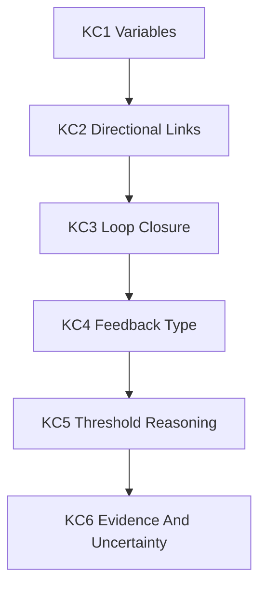

# Adaptive AI Tutor Prototype

## Target Tutoring Skill

**Explain a climate feedback loop and identify when feedback can contribute to a tipping threshold.**

This skill was chosen because it is difficult enough to require genuine tutoring. Students often know vocabulary such as "feedback loop" but cannot trace causal relationships or distinguish feedback from ordinary cause and effect.

## Knowledge Component Map

| KC ID | Knowledge Component | Description | Depends On | Evidence Of Mastery | Common Error |
|---|---|---|---|---|---|
| KC1 | System variable identification | Identifies relevant variables in a climate system | None | Names variables such as temperature, ice cover, albedo, absorbed radiation | Lists topics rather than variables |
| KC2 | Directional causal link | States how change in one variable affects another | KC1 | "Less ice lowers albedo, increasing absorbed solar radiation" | Uses vague links: "ice affects heat" |
| KC3 | Feedback loop closure | Traces a causal chain back to amplify or dampen the starting variable | KC2 | Completes loop: warming reduces ice, reducing albedo, causing more warming | Produces a one-way chain only |
| KC4 | Positive vs negative feedback | Distinguishes reinforcing from stabilising feedback | KC3 | Correctly labels ice-albedo as positive feedback | Thinks positive means "good" |
| KC5 | Threshold reasoning | Explains how feedback can make change nonlinear near a threshold | KC4 | Describes self-reinforcing shift after resilience is weakened | Treats tipping point as any bad impact |
| KC6 | Evidence and uncertainty language | Uses cautious scientific claims linked to evidence | KC5 | "Models suggest risk increases beyond..." | Says "will definitely happen by..." |

## Dependency Graph

## Mastery Tracking

The prototype uses a simple mastery estimate per knowledge component:

- **Initial state:** unknown unless prior session evidence exists
- **Mastery evidence:** correct independent use across at least two surface contexts
- **Scaffolded evidence:** correct use after hints, tagged separately
- **Unassisted evidence:** no hints, no examples, no correction until full attempt submitted

The system should never treat scaffolded success as mastery.

## Adaptive Hint Ladder

### Error: Student lists concepts but no variables

- **Level 1:** "What are the things in this system that can increase or decrease?"
- **Level 2:** "Think of the system like a set of dials. Which dials are changing?"
- **Level 3:** "The key move is to name variables, not topics. Try naming measurable quantities."
- **Level 4:** "Start with temperature and ice cover. What else changes when those change?"
- **Level 5:** "Parallel example: in a predator-prey system, variables might be predator population and prey population. Now identify the variables in ice-albedo feedback."

### Error: Student creates a one-way chain but no loop

- **Level 1:** "Does your chain ever return to affect the thing that started changing?"
- **Level 2:** "A loop is like a microphone near a speaker: the output feeds back into the input. Where does that happen here?"
- **Level 3:** "A feedback loop must close. Find the point where the final change increases or reduces the original change."
- **Level 4:** "You have warming -> less ice -> lower albedo -> more absorbed radiation. What does more absorbed radiation do to warming?"
- **Level 5:** "Parallel example: more anxiety -> worse sleep -> poorer concentration -> more anxiety. Now close the climate loop in the same way."

### Error: Student says "positive feedback is good"

- **Level 1:** "In science, does positive always mean beneficial?"
- **Level 2:** "Think of positive as adding to the direction of change, not judging whether it is good."
- **Level 3:** "Positive feedback reinforces the initial change. Negative feedback counteracts it."
- **Level 4:** "If warming leads to more warming, that is positive feedback, even if the consequence is harmful."
- **Level 5:** "Parallel example: compound interest is positive feedback because growth produces more growth. Use that meaning here."

## Tutor Behaviour Rules

The tutor must:

- require a recall attempt before explanation
- ask for confidence before and after
- identify accurate ideas, gaps, and misconceptions
- use the lowest useful hint level
- ask the learner to explain what a hint revealed before escalating
- tag support level and misconception type
- run an unassisted checkpoint after scaffolded practice

The tutor must not:

- complete the student's systems map
- provide a polished final answer before the student attempts one
- treat fluency as understanding
- overstate scientific certainty
- cite sources it has not helped the student verify

## Example Formative Assessment Loop

1. Student attempts to explain ice-albedo feedback.
2. AI detects KC3 gap: chain does not close.
3. AI uses Level 1 question.
4. Student revises but still does not close loop.
5. AI uses Level 4 procedural nudge.
6. Student closes loop.
7. AI tags: `KC3 scaffolded_success`, `hint_level_reached: 4`.
8. AI gives a near-transfer task: permafrost carbon feedback.
9. Student attempts independently.
10. AI checks whether KC3 transfers to new surface context.
11. AI later administers an unassisted checkpoint on AMOC or Amazon feedback.
