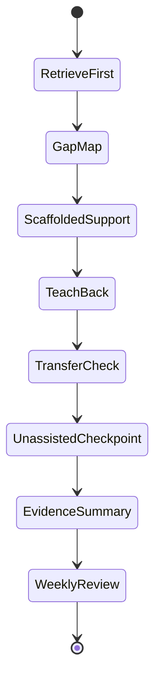

# Implementation And Technical Notes

## Product Architecture Implication

This showcase implies a three-layer product architecture:

1. **Skill Library:** evidence-grounded pedagogical capabilities with metadata and schemas.
2. **Context Engine:** class profiles, curriculum goals, prior learning, student evidence, and constraints.
3. **Orchestrator:** routes tasks through skills, manages handoffs, records evidence, and enforces quality gates.

## Minimal Technical Prototype

A credible prototype could be built with:

- a skill registry loaded from `registry.json`
- a router that selects skills by task intent and chain metadata
- a context object for class profile, unit goals, and student evidence
- a tutoring session state machine
- an evidence log
- a teacher dashboard showing misconception, confidence, support level, and independence data

## Tutor State Machine



## Evidence Schema Sketch

```json
{
  "student_id": "anon-014",
  "session_id": "climate-feedback-003",
  "topic": "ice-albedo feedback",
  "confidence_before": 45,
  "confidence_after_retrieval": 40,
  "recall_quality": "partial",
  "misconceptions": [
    "positive feedback means beneficial",
    "tipping point means any severe climate effect"
  ],
  "knowledge_components": {
    "KC1_variable_identification": "independent",
    "KC2_directional_causal_link": "independent",
    "KC3_feedback_loop_closure": "scaffolded_hint_level_1",
    "KC4_positive_vs_negative_feedback": "independent_after_prompt",
    "KC5_threshold_reasoning": "partial",
    "KC6_uncertainty_language": "secure"
  },
  "transfer": {
    "near": "passed",
    "far": "passed"
  },
  "unassisted_checkpoint": {
    "task": "Amazon forest dieback feedback",
    "performance": "strong",
    "support_tag": "unassisted"
  },
  "next_instructional_action": "sharpen threshold reasoning"
}
```

## Teacher Dashboard Views

| View | Purpose |
|---|---|
| Misconception heatmap | Shows which knowledge components need reteaching |
| Assistance profile | Distinguishes independent, scaffolded, and unassisted performance |
| Confidence calibration | Shows overconfidence or underconfidence patterns |
| AI audit quality | Tracks whether students can verify AI claims |
| Transfer evidence | Shows whether students can apply ideas beyond taught examples |

See [Teacher Dashboard Specification](./teacher-dashboard-specification.md) for a concrete dashboard mockup and event model.

## Governance Boundary

See [Privacy And Governance Notes](./privacy-and-governance-notes.md) for data minimisation, retention, teacher validation, and formative-use boundaries. A production system should treat AI-generated evidence as decision support, not automatic judgement.

## Professional Demo Talking Points

### For Tech Teams

- The library already has machine-readable schemas.
- Chaining metadata gives an initial routing graph.
- Domain 20 skills provide a session-level interaction model.
- Evidence capture fields can become analytics events.
- Quality gates can be implemented as orchestrator constraints.

### For Investors

- The product wedge is defensible pedagogy, not content generation.
- The evidence stream creates value for teachers, schools, parents, and learners.
- The system can integrate with LMS, tutoring, assessment, curriculum, and school model products.
- The skills library can become infrastructure for many education AI surfaces.

### For Curriculum Teams

- The model preserves alignment between outcomes, activities, assessment, and evidence.
- It handles interdisciplinary and project-based learning without abandoning validity.
- It supports teacher review rather than replacing professional judgement.

### For School Founders

- The learning model is coherent with future-facing education: agency, complexity, systems literacy, AI literacy, wellbeing, and rigorous academic understanding.
- It avoids the trap of making students responsible for fixing adult systems.
- It demonstrates how AI can support self-directed learning without hollowing it out.
