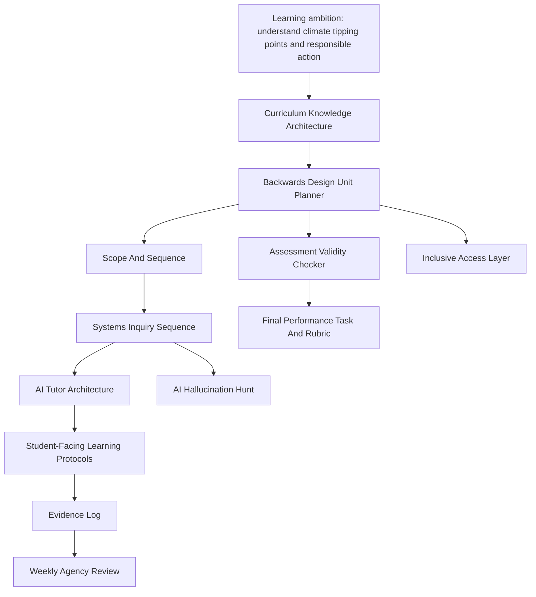

# Orchestration Map

## High-Level Chain

## Detailed Skill Handoffs

| Step | Skill | Input | Output | Handoff |
|---|---|---|---|---|
| 1 | `curriculum-knowledge-architecture-designer` | Climate tipping points, nonlinear systems, feedback loops, uncertainty, evidence use | Knowledge type map: factual, conceptual, procedural, epistemic, ethical | Feeds learning targets and sequencing |
| 2 | `backwards-design-unit-planner` | Desired outcomes, level, duration, curriculum goals | UbD unit: enduring understandings, essential questions, assessment evidence, learning plan | Feeds scope, assessment, lesson sequence |
| 3 | `scope-and-sequence-designer` | Four-week timeline, target concepts, prior knowledge | Week-by-week progression | Feeds lesson design and spaced retrieval |
| 4 | `phenomenon-based-unit-anchor` | Amazon dieback, AMOC slowdown, ice-albedo feedback | Multidisciplinary phenomenon anchor | Feeds systems inquiry |
| 5 | `systems-awareness-iceberg` | Visible event: "Scientists warn that some Earth systems may cross tipping thresholds" | Event, patterns, structures, mental models | Feeds hexagon mapping and leverage analysis |
| 6 | `hexagon-complexity-mapper` | System factors: carbon, albedo, permafrost, forests, oceans, policy, uncertainty | Relationship map and claims | Feeds leverage and response design |
| 7 | `leverage-and-response-design` | Systems map and stakeholder context | Possible interventions and unintended consequence checks | Feeds local action project |
| 8 | `agency-circles-for-systems-action` | Student action context | Control, influence, concern map | Prevents heroic student-fixer framing |
| 9 | `cognitive-tutoring-architecture-designer` | Target skill: explaining feedback loops and tipping thresholds from graphs | Knowledge components, dependency graph, mastery logic | Feeds tutor dialogue and adaptive hints |
| 10 | `adaptive-hint-sequence-designer` | Knowledge components and common errors | Hint ladder by error type | Feeds live tutoring |
| 11 | `intelligent-tutoring-dialogue-designer` | Target misconceptions and tutor architecture | Multi-turn dialogue | Feeds student session |
| 12 | `retrieve-first-gate` | Topic and session context | Recall attempt, confidence, gap map | Starts every learning interaction |
| 13 | `progressive-hint-ladder` | Student attempt and stuck point | Minimum-help support level | Produces support evidence |
| 14 | `teach-back-evaluator` | Student explanation | Gap-revealing peer questions | Checks organisation of understanding |
| 15 | `transfer-bridge` | Demonstrated understanding | Near and far transfer challenges | Tests portability |
| 16 | `unassisted-evidence-checkpoint` | Scaffolded session summary | Independent performance evidence | Separates supported from independent learning |
| 17 | `ai-hallucination-fact-check-protocol` | AI climate science summary with citations | Verification protocol and activity | Builds AI literacy |
| 18 | `udl-barrier-anticipator` | Learning task and learner variability | Access barriers and design changes | Feeds inclusive redesign |
| 19 | `language-demand-analyser` | Reading, graph, and debate tasks | Vocabulary and syntax barriers | Feeds scaffolds |
| 20 | `assessment-validity-checker` | Final task and rubric | Validity, alignment, reliability checks | QA gate before delivery |

## Evidence Objects

Each student interaction produces structured evidence:

| Evidence Field | Example |
|---|---|
| `confidence_before` | 42 |
| `confidence_after` | 67 |
| `recall_quality` | partial |
| `misconception` | "A tipping point is any severe climate effect" |
| `hint_level_reached` | 3 |
| `error_type` | conceptual |
| `support_tag` | scaffolded |
| `transfer_check` | near passed, far partial |
| `unassisted_performance` | partial |
| `next_action` | retrieve feedback-loop vocabulary tomorrow |

## Quality Gates

The orchestrator should not proceed if:

- assessment measures activism, presentation quality, or attitude rather than climate-system reasoning
- AI tutor provides full answers before learner attempts retrieval
- systems activity individualises blame for structural problems
- local action project asks students to solve problems beyond their authority
- AI-literacy task only says "AI can be wrong" without teaching source reconstruction
- inclusive adaptation reduces cognitive demand instead of changing access routes
